# Long Video HEVC Plug-in for RICOH THETA

Records 4K video with a maximum length of 1 hour 24 minutes. 
It overcomes the 25 minute video limitation of the standard THETA V.

## Benefits

* 336% increase in length of video saved to camera - increased time from 25 minutes to 84 minutes
* 40% reduction in file size - save more videos of shorter length
* 40% faster uploads to YouTube and Facebook

## Technical Features

This plug-in  uses HEVC, not the default H.264.

To view the video on Windows 10 Movies and TV Player, you must
add HEVC support to the player.

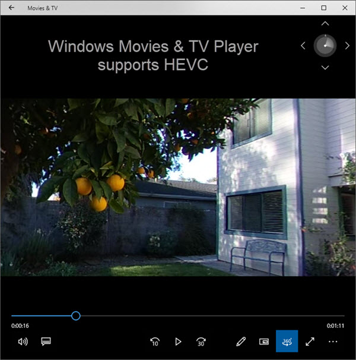

Both Premiere Pro and CyberLink PowerDirector 17 can handle HEVC.

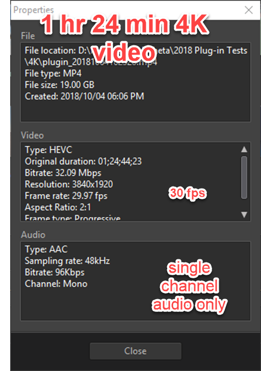

The bitrate is reduced to 32Mbps. I'm hoping that due to the use of 
HEVC, the quality will be comparable to 56Mpbs with H.264.

I plan to submit the plug-in to the [RICOH THETA Plug-in Store](https://pluginstore.theta360.com/).
Look for "Long Video HEVC".

If you are are compiling from source, follow these steps for installation:

1. install plug-in with adb
2. set permissions with Vysor
3. use the THETA Desktop app to set the default plug-in "Long 4K Video"

## Usage

1. put camera into plug-in mode
2. take video
3. stop plug-in by pressing lower mode button
4. turn camera off by pressing the power button for 8 seconds
5. turn camera back on and plug into your computer with a USB cable
6. look for the file in /RICOH THETA V/Fixed Storage/DCIM/100RICOH

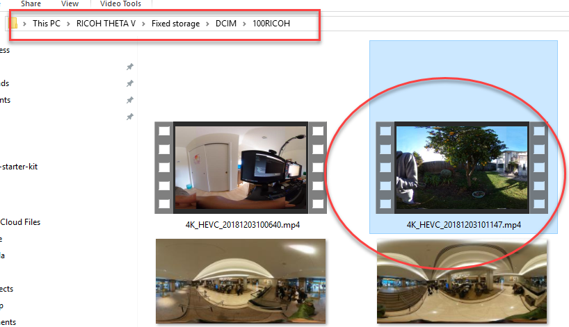

## Post Production

### Spatial Media Metadata Injector

You may need to inject the metadata into the video file
with [Spatial Media Metadata Injector](https://github.com/google/spatial-media/releases).

Install the binary file with the link above. Pre-built applications are available for Mac and Windows.

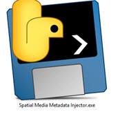

Open the file.

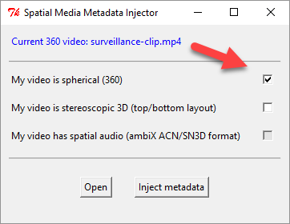

Save the file with metadata injected with a new filename. Use the new video file
with injected metadata in your applications and on YouTube/Facebook.

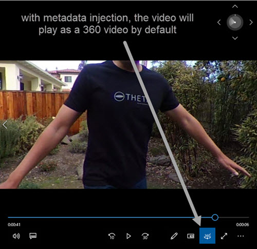

### Editing Videos

Both Premiere Pro and PowerDirector support HEVC 360° video editing.

#### Premiere Pro

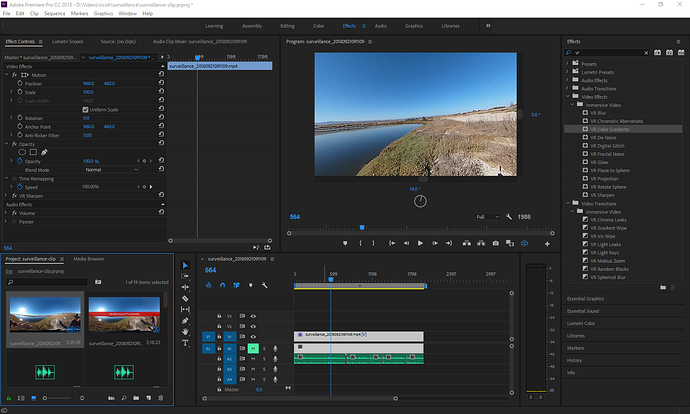

#### CyberLink PowerDirector 17

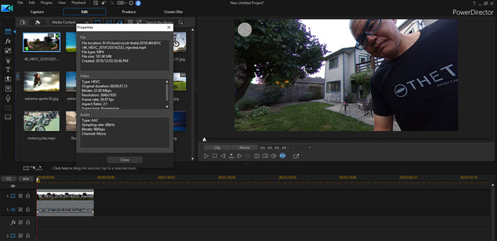

You do not need to export to H.265 HEVC. You can export with any encoding.
However, if you want to keep the encoding the same, CyberLink does support
HEVC format output, which will give you a smaller file size than H.264.

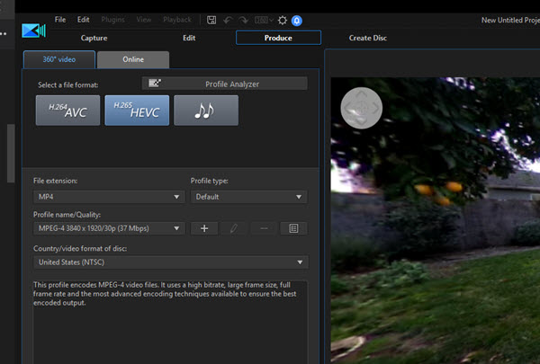

## Sharing HEVC-encoded 360° Videos on Social Media

After injecting the metadata, you can upload the HEVC file directly to YouTube and YouTube. 
With the metadata, it will automatically be detected as a 360° video.

### YouTube

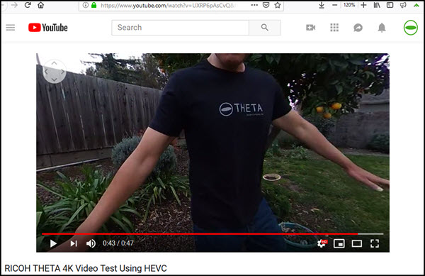

https://youtu.be/UXRP6pAsCvQ

### Facebook

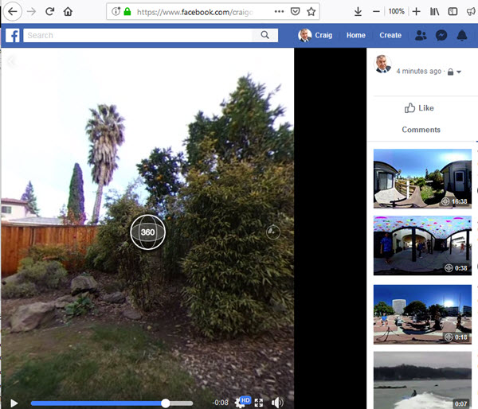

## Limitations

* No spatial audio. The code can be modified to save a 4ch spatial audio .wav file with first-order ambisonics B-format. 
The spatial audio file is not saved by default to avoid people having to delete the file.
* Heat. I have not tested this fully, but the camera does seem to get hotter. You may need to blow a fan on the 
outside of the camera body. Or, use it in the winter only. ;-)

